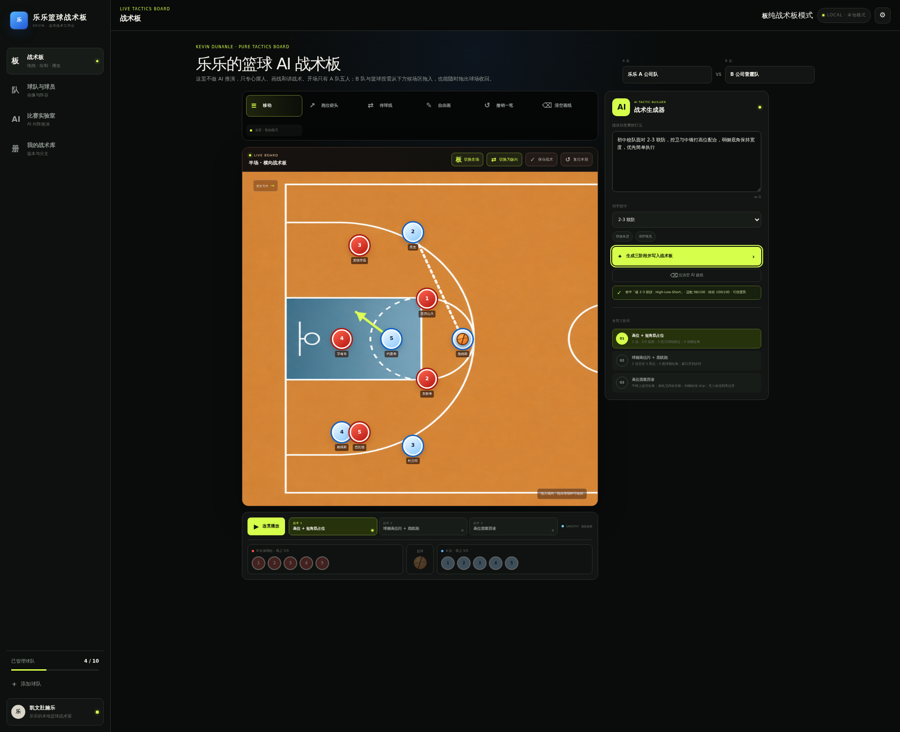
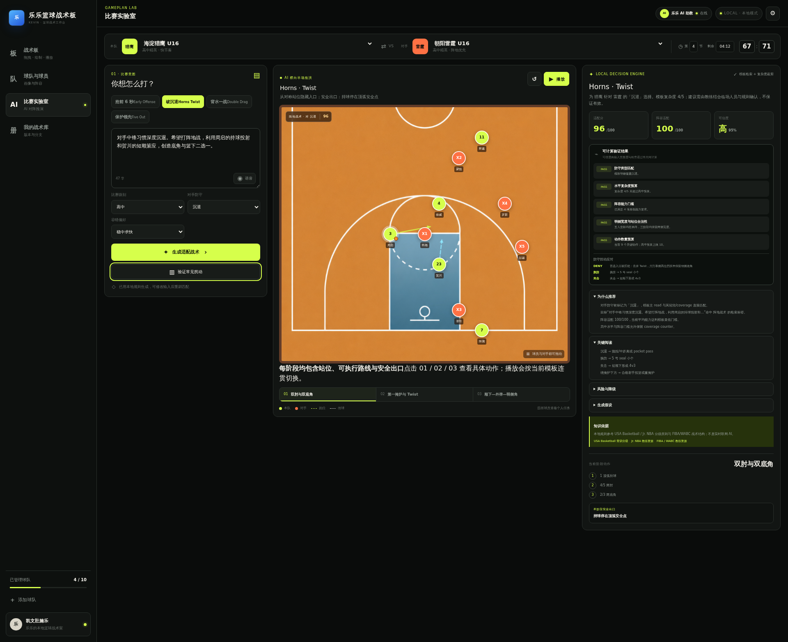
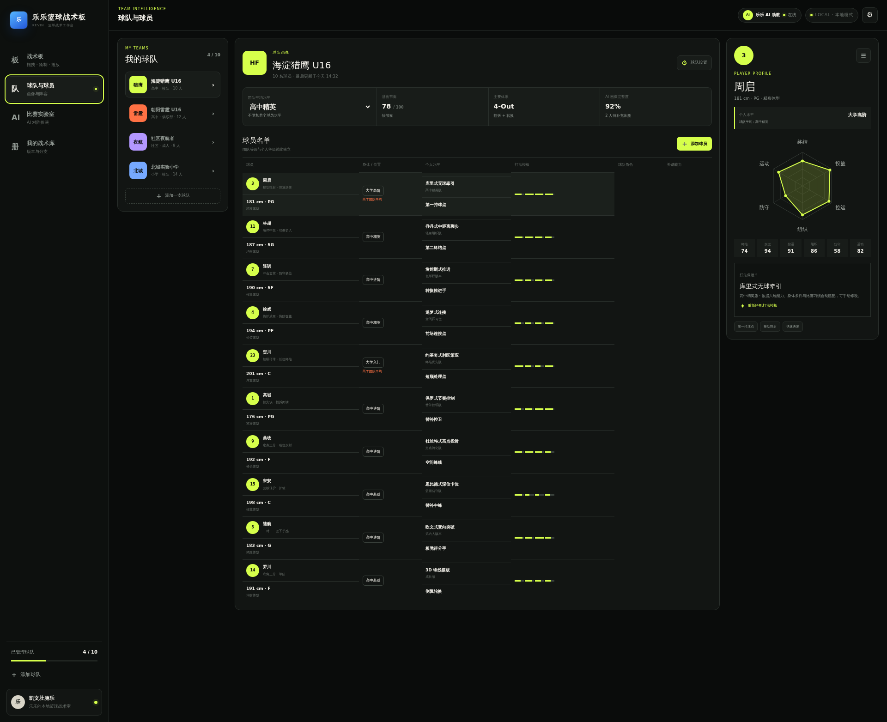
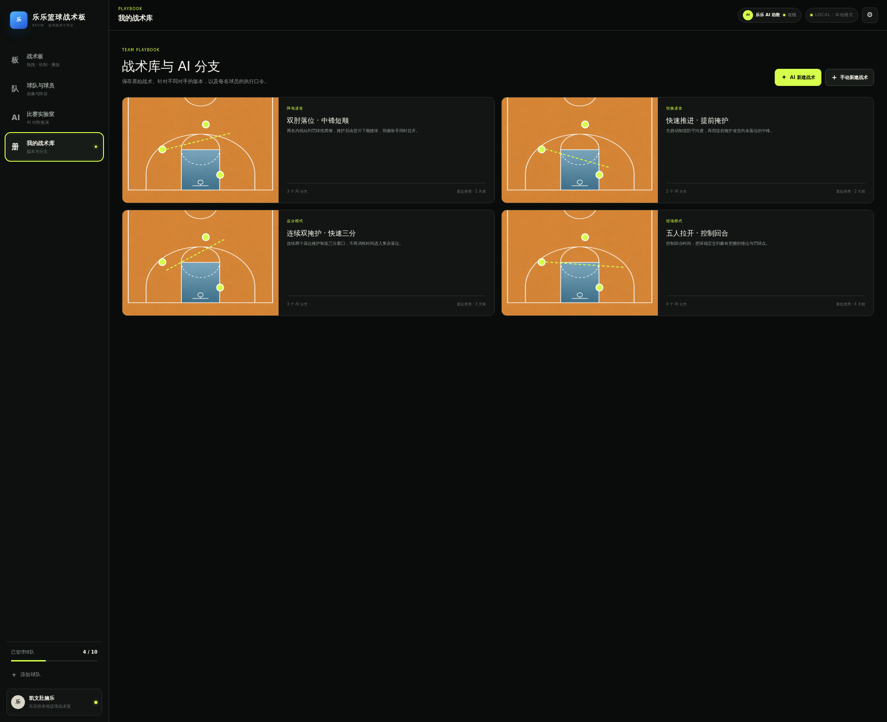
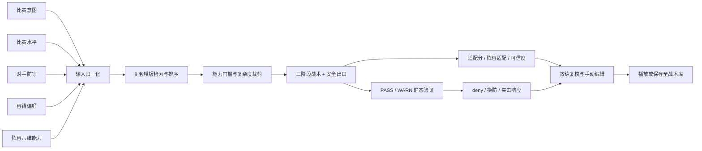

# 乐乐 AI 篮球战术板 / LELE TACTICS

> **把教练的比赛意图，转成可编辑、可解释、可降级的三阶段战术。**
>
> *Draw the play. Read the defense. Keep the fallback.*



LELE TACTICS 是一个面向篮球教练、青训团队与战术爱好者的本地篮球战术工作台。它把可拖拽战术板、球队与球员画像、规则驱动的战术推荐、对阵验证和战术库放在同一套交互中：既能手动画一次进攻，也能从比赛意图出发，得到包含落位、发起、终结和安全出口的可执行方案。

当前版本是**本地交互原型与规则决策系统**，不是已经接入大模型、实时视频识别或比赛数据训练的竞技预测产品。

## 为什么它不只是画板

传统电子战术板解决的是“怎么把路线画出来”；LELE TACTICS 进一步尝试回答“为什么这样打、这套方案是否适合当前阵容、对手改变防守后怎么办”。

- **本地战术决策引擎**：`generateTactic()` 是纯函数，基于比赛水平、对手防守、战术意图、容错偏好、球队与阵容能力进行模板检索、复杂度裁剪、静态校验与解释；当前不依赖远程 AI 服务。
- **8 套结构化模板**：覆盖转换进攻、5-out 连续进攻、4-out-1-in、Horns、Spain PnR、ATO 边线球、联防进攻与保护领先等场景。每套模板均包含三阶段站位、路线、阅读、风险和降级方案。
- **六维阵容能力**：以**终结、投篮、控运、组织/传球、防守、运动能力**形成球员画像，并聚合为阵容输入；能力门槛会影响模板排序、阵容适配与复杂度裁剪。
- **多条件约束**：同时考虑比赛水平、防守类型、容错偏好与阵容六维能力，而不是只做关键词命中。
- **适配分与可信度**：输出战术适配分、阵容适配分、能力缺口和可信度等级；可信度由输入完整度与静态检查通过率共同计算，不等同于胜率。
- **PASS / WARN 压力测试**：检查防守匹配、水平复杂度预算、阵容能力门槛、站位与弱侧宽度、动作数量预算，并给出 deny、换防、夹击场景下的应对。
- **可解释且可降级**：推荐结果附带理由、关键阅读、假设、风险、更简单备选与每阶段安全出口。

> [!IMPORTANT]
> 所有评分、检查与建议都是规则系统在显式输入上的辅助判断，**不保证战术有效，更不保证比赛结果**。最终决策应由教练结合规则、人员状态、训练质量和临场信息作出。

## 核心功能

### 1. LIVE TACTICS BOARD · 可编辑战术板

- 半场 / 全场、横向 / 纵向切换
- A/B 两队与篮球自由拖入、移动和移出球场
- 跑位箭头、传球虚线、自由画笔、撤销与清空
- 三阶段快照与连续插值播放
- 将本地生成结果直接写回战术板并继续人工调整

### 2. GAMEPLAN LAB · 比赛实验室

- 输入比赛意图、比赛级别、对手防守与容错偏好
- 支持盯人、2-3 联防、3-2 联防、换防、沉退和全场压迫
- 生成“落位 → 发起 → 终结”三阶段方案
- 展示适配分、阵容适配、可信度、推荐理由、风险与备选
- 用 PASS / WARN 检查和常见扰动响应辅助教练复核

### 3. TEAM INTELLIGENCE · 球队与球员画像

- 管理球队、球员、位置、身体条件、个人水平与球队角色
- 维护六维能力雷达图与打法模板
- 球队平均水平和球员个人水平彼此独立
- 阵容能力聚合后参与战术匹配，而非仅用于展示

### 4. PLAYBOOK · 战术库

- 保存当前三阶段战术、路线与生成结果
- 从预设比赛意图快速进入实验室
- 支持手动新建与规则引擎生成两条创作路径

## 产品截图

<table>
  <tr>
    <td width="50%"><br /><strong>比赛实验室</strong>：战术推荐、解释与压力测试</td>
    <td width="50%"><br /><strong>球队与球员</strong>：阵容管理与六维能力画像</td>
  </tr>
  <tr>
    <td colspan="2"><br /><strong>战术库</strong>：保存、复用与继续编辑</td>
  </tr>
</table>

## AI / 规则引擎工作流



这里的 “AI” 指产品交互中的智能助教体验。当前落地能力由本地规则、模板与决策树提供；真实 LLM 结构化输出仍在 Roadmap 中。

## 技术栈

| 层级 | 技术 |
| --- | --- |
| UI | React 19、TypeScript 5.9、原生 Canvas |
| 应用框架 | vinext 1.0 beta、Vite 8、React Server Components 相关运行时 |
| 样式 | Tailwind CSS 4 工具链 + 项目样式 |
| 运行与构建 | Node.js ≥ 22.13、npm、Wrangler / Cloudflare Vite Plugin |
| 测试 | Node.js 内置 test runner，构建后 HTML 渲染测试 |
| 数据层预留 | Drizzle ORM / Drizzle Kit（当前核心战术流程未体现持久化接入） |

## 项目结构

```text
q-project-analysis/
├── app/
│   ├── page.tsx              # 四大产品模块、状态与 Canvas 交互
│   ├── tactics.ts            # 8 套模板、本地决策、验证与压力测试
│   └── ...                   # 布局与样式
├── docs/screenshots/         # README 产品截图
├── public/                   # 球场底图与公开静态资源
├── tests/
│   └── rendered-html.test.mjs
├── outputs/                  # 产品分析报告
└── package.json              # 脚本、依赖与 Node 版本约束
```

## 本地启动

### 环境要求

- Node.js **≥ 22.13.0**
- npm（建议使用随 Node.js 安装的版本）

```bash
npm ci
npm run dev
```

启动后按终端输出访问本地地址。

### 构建与测试

```bash
npm run build
npm test
```

`npm test` 会先执行生产构建，再运行 `tests/rendered-html.test.mjs`。目前该测试仍包含旧 Starter 加载页、旧依赖与元数据断言，与现有产品页面不一致时可能失败；应将这些断言更新为 LELE TACTICS 的实际渲染结果。此说明不代表跳过构建检查。

## 设计原则

1. **先表达，再智能化**：手动画板始终可用；生成结果必须允许继续移动、绘制和修改。
2. **建议必须可解释**：不只给战术名，还要给推荐理由、关键阅读、风险、假设和安全出口。
3. **复杂度服从执行能力**：低龄、基础水平、能力缺口或偏保守场景应主动裁剪同步动作和二次分支。
4. **输入不完整就降低可信度**：缺失数据不伪装成精确结论，也不把缺失项简单当作 0。
5. **教练保留最终决定权**：系统负责组织信息与暴露风险，不替代现场观察、训练验证和专业判断。

## 数据边界

- 当前球员、球队与比赛信息主要保存在前端运行状态中，刷新后不保证保留。
- 当前防守类型来自人工选择，不包含实时视频识别。
- 六维阵容能力采用球员属性的简单平均，尚未表达角色差异、样本量、对位分布与状态波动。
- 适配分和可信度是规则系统的内部辅助指标，不是经真实比赛校准的胜率、得分预期或因果结论。
- NBA 数据或 BALLDONTLIE 等**公开统计 API**未来可用于补足球员画像；当前项目未声明已接入这些 API。即使接入，统计相关性也只能描述球员或阵容特征，**不能单独证明某套战术有效**。
- 任何战术建议都需要经过教练审核、训练执行和真实场景复盘。

## Roadmap

- [ ] **持久化**：球队、球员、战术、版本历史与导入导出
- [ ] **真实 LLM 结构化输出**：以受约束 schema 生成阶段、路线、阅读、风险和降级方案
- [ ] **视频标注**：球场校准、球员轨迹、掩护、换防、协防与空位窗口
- [ ] **角色级画像**：从简单阵容均值升级到持球点、射手、连接点、护筐者等角色建模
- [ ] **训练反馈闭环**：战术建议 → 训练任务 → 执行反馈 → 教练修订 → 模板沉淀

## 参考原则

本项目的分级、训练与战术组织思路参考以下公开教练资源；这些链接是原则参考，不表示官方合作或背书：

- [USA Basketball Youth Development](https://www.usab.com/youth/development)
- [Jr. NBA Coach Resources](https://jr.nba.com/)
- [FIBA / WABC Coaches Platform](https://wabc.fiba.com/)

## 作者

**贾长乐**
