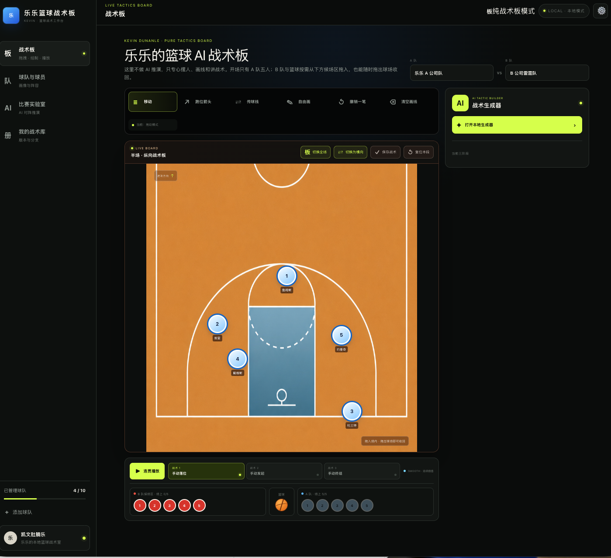
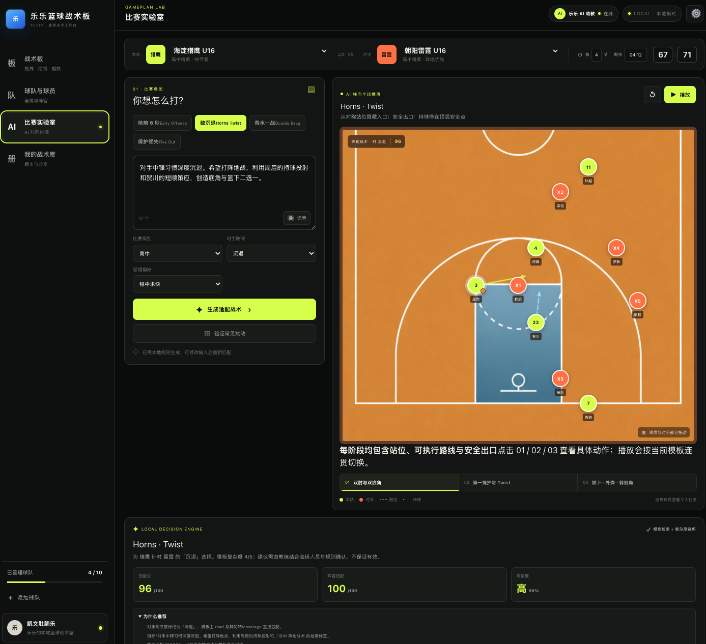
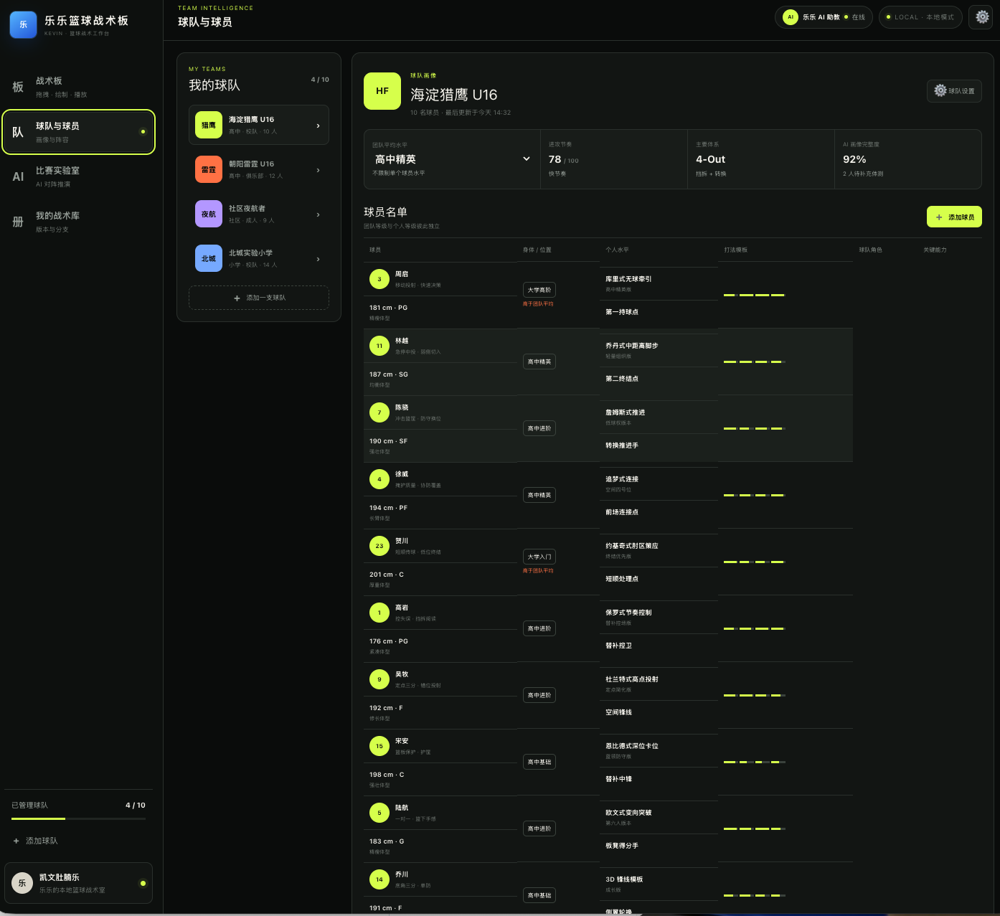
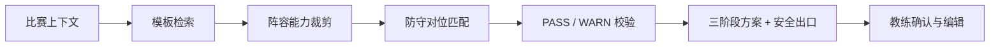

# LELE TACTICS / 乐乐 AI 篮球战术板

> **把比赛意图，转化为可解释、可验证、可继续编辑的战术决策。**  
> *A decision workspace for basketball coaches — not another arrow-drawing tool.*

LELE TACTICS 不是“画箭头工具”，而是一套面向篮球教练的**可解释战术决策工作台**：将战术画板、球队画像、阵容能力、对手防守与规则校验放进同一条工作流，让每个建议都能回答——**为什么这样打、谁来执行、风险在哪里、失效后怎么退。**



## 四个硬核支点

| | 能力 | 它解决什么 |
| --- | --- | --- |
| **01** | **真实战术模板** | 8 套结构化模板覆盖转换进攻、5-out、4-out-1-in、Horns、Spain PnR、ATO 边线球、联防进攻与保护领先；不是从空白文本随机生成。 |
| **02** | **阵容能力适配** | 用终结、投篮、控运、组织/传球、防守、运动能力六维画像参与排序与裁剪，让方案服从执行者。 |
| **03** | **对手防守识别** | 基于教练选择的盯人、联防、换防、沉退或压迫等防守输入，匹配针对性模板与关键阅读；当前不包含视频自动识别。 |
| **04** | **PASS / WARN 压力测试** | 对防守匹配、能力门槛、复杂度预算、站位宽度与动作数量做静态校验，并暴露 deny、换防、夹击下的风险。 |

## AI 不自由编战术，它在约束中做决策

```text
模板检索 → 能力裁剪 → 对位匹配 → 约束校验 → 教练确认
```

系统先从已定义战术模板中检索，再按比赛级别、容错偏好与阵容能力降低复杂度，结合对手防守完成匹配，通过 PASS / WARN 校验后交给教练复核。生成结果包含**落位 → 发起 → 终结**三阶段，以及推荐理由、关键阅读、风险和安全出口；教练始终可以继续移动、绘制、修改或放弃。

> [!IMPORTANT]
> 当前“AI”由本地规则、模板与决策树实现，不依赖远程大模型。适配分与可信度是辅助判断，不是胜率；系统不保证战术有效或比赛结果。

## 一块板，贯通赛前判断与场上表达

<table>
  <tr>
    <td width="50%" valign="top">
      
      <br /><strong>MATCH LAB · 比赛实验室</strong><br />输入比赛意图、级别、对手防守与容错偏好；查看战术推荐、解释、适配结果与压力测试。
    </td>
    <td width="50%" valign="top">
      
      <br /><strong>TEAM INTELLIGENCE · 球队智能</strong><br />管理球队、球员、位置、角色与六维能力；阵容画像真实进入战术匹配，而非只做展示。
    </td>
  </tr>
</table>

## 核心能力

- **LIVE TACTICS BOARD**：半场 / 全场与横纵向切换；球员、篮球拖拽；跑位、传球、自由画笔、撤销与清空。
- **THREE-PHASE PLAY**：保存三阶段快照并连续播放；生成结果可写回战术板继续人工调整。
- **GAMEPLAN LAB**：从比赛意图生成三阶段方案，呈现适配分、可信度、理由、风险与备选。
- **TEAM INTELLIGENCE**：维护球员属性与打法模板，将阵容六维聚合结果送入决策链路。
- **PLAYBOOK**：保存、复用三阶段战术与路线，支持手动创作和规则引擎生成两条路径。

## 战术知识引擎

`app/tactics.ts` 中的 `generateTactic()` 是本地纯函数。它综合比赛意图、比赛水平、防守类型、容错偏好和阵容能力，完成模板排序、复杂度裁剪、静态验证与解释输出。



## 技术栈

| 层级 | 技术 |
| --- | --- |
| UI | React 19、TypeScript 5.9、原生 Canvas |
| 应用框架 | vinext 1.0 beta、Vite 8 |
| 样式 | Tailwind CSS 4 工具链 + 项目样式 |
| 构建与运行 | Node.js ≥ 22.13、npm、Wrangler / Cloudflare Vite Plugin |
| 测试 | Node.js 内置 test runner、构建后 HTML 渲染测试 |
| 数据层预留 | Drizzle ORM / Drizzle Kit；核心战术流程当前未接入持久化 |

## 本地启动

需要 Node.js **≥ 22.13.0**。

```bash
npm ci
npm run dev
```

构建与测试：

```bash
npm run build
npm test
```

> 当前测试仍含 Starter 阶段的旧渲染断言，若与现有产品页面不一致，需按实际页面更新断言。

## 项目结构

```text
q-project-analysis/
├── app/
│   ├── page.tsx              # 产品模块、状态与 Canvas 交互
│   ├── tactics.ts            # 战术模板、决策、验证与压力测试
│   └── globals.css           # 产品视觉样式
├── docs/screenshots/         # README 产品截图
├── public/                   # 球场底图与静态资源
├── tests/                    # 渲染测试
└── package.json              # 脚本、依赖与 Node 版本约束
```

## 能力边界

- 球队、球员与比赛信息当前主要保存在前端运行状态中，刷新后不保证保留。
- 对手防守类型由教练人工输入，尚无实时视频识别。
- 阵容能力目前采用球员属性聚合，尚未完整表达角色差异、样本量、对位分布与状态波动。
- 评分和建议来自显式规则，不是经真实比赛校准的因果结论；最终决策属于教练。

## Roadmap

- [ ] 球队、球员、战术与版本历史持久化
- [ ] 受约束 Schema 下的 LLM 结构化输出
- [ ] 视频标注与球员轨迹 / 掩护 / 协防识别
- [ ] 从阵容均值升级到持球点、射手、连接点、护筐者等角色建模
- [ ] 建立“建议 → 训练 → 反馈 → 修订 → 模板沉淀”闭环

## 参考原则

分级、训练与战术组织思路参考公开教练资源，不表示官方合作或背书：

- [USA Basketball Youth Development](https://www.usab.com/youth/development)
- [Jr. NBA Coach Resources](https://jr.nba.com/)
- [FIBA / WABC Coaches Platform](https://wabc.fiba.com/)

## 作者

**贾长乐**
